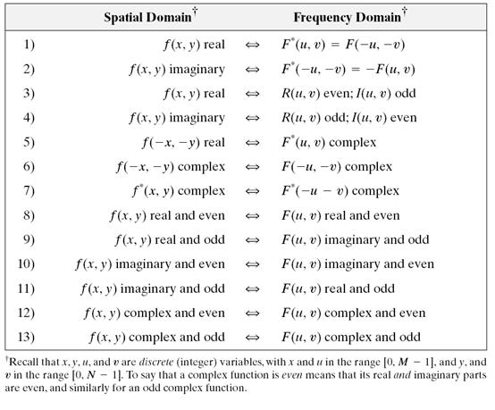
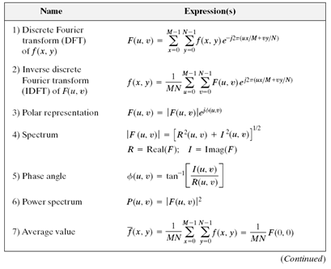
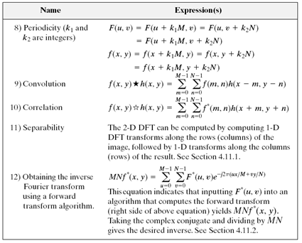
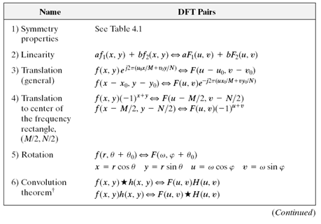
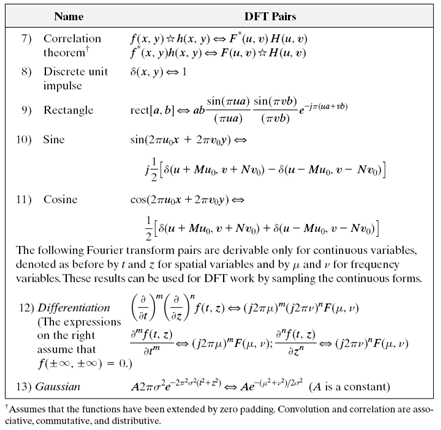
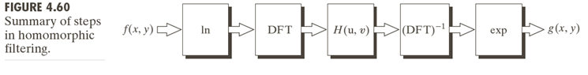
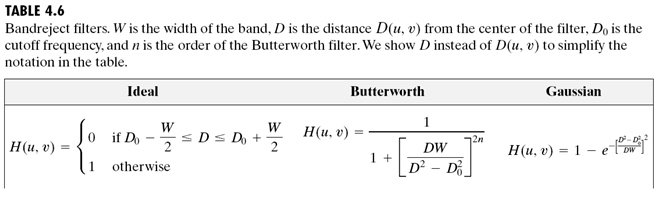
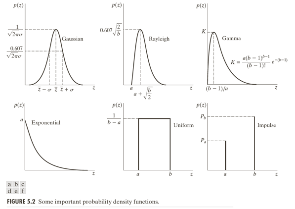

# Chap.1 Introduction

​	改善图示信息以便人们解释； 为存储、传输和表达而对图像数据进行处理，以便于机器自动理解。
​	数字图像处理是借助于数字计算机处理数字图像
​	
$\qquad$$\qquad$图像源：从伽马射线到无线电波的整个电磁波谱，包括超声波‘电子显微镜和计算机生成的图像
​			电磁能谱，声波、超声波、电子
​			图像处理-图像分析/理解-计算机视觉 的连续统
​			低级-中级-高级 处理

### 1.2 起源

​		电缆传输图片
​		计算机的兴起
​		空间项目的开发
​		CT（计算机断层）

### 1.3 实例应用

### 1.4 基本步骤

​		输入-输出都是图像
​		输入图像-输出提取的属性

$\qquad$$\qquad$_Figure 1.23_
​		图像获取image acquisition
​		图像增强(image enhancement)：使图像在特定应用中比原始图像更适合进行处理
​		图像复原(image restoration)：倾向于以图像退化的数学或概率模型为基础
​		彩色图像处理(color image processing)
​		小波：以不同辨率来描述图像的基础(wavelets and multiresolution processing)
​		压缩(compression)
​		形态学处理(morphological processing)
​		分割(segmentation)
​		表示（representation 确定表示范围，比如边界或者整个区域）与描述（description 特征选择）
​		识别(recognition)：基于目标的描述给该目标赋予标志
​		显示(display)

### 1.5 图像处理系统的组成

​	_Fig. 1.24_

# 第2章 数字图像基础

​		

### 2.1 人类视觉系统

​			人眼结构  
​			眼中图像的形成  
​			亮度适应和辨别  
​			

### 2.2 光和电磁波谱

​			E=hv 光子 频率段  
​			单色光/无色光 的唯一属性是 强度，用 灰度级 表示，从黑到白的度量  值通常称为 灰度级  
​			彩色光源：发光强度（能量总和，瓦特）　光通量（流明数，观察者从光源感受到的能量）　	亮度（主观描述）  
​			要求“看到”一个物体的电磁波的波长必须小于等于物体的尺寸  
​		

### 2.3 图像感知和获取

​			照射源， 场景  
​			照射可以由非传统光源，比如超声波甚至计算机产生的照射模式。  
​			平坦表面反射 透射  
​			
$\qquad$$\qquad$$\qquad$单个传感器，条带传感器，阵列传感器  
​			简单的图像形成模型 2.3.4  
​			反射系数/透射系数 * 入射分量  
​			灰度级/强度级 $l=0$黑色 $l=L-1$白色 gray scale  

### 2.4 取样和量化 

​			取样：对坐标值进行数字化　＝》样本数  
​			量化：对幅值数字化　＝》灰度级  
​			实践中，取样方法由生成该图像的传感器配置决定  
​			
$\qquad$$\qquad$$\qquad$二维阵列  $f(x,y)$		
​			三种表示*Fig2.18*  

​			图像原点位于左上角：图像显示器, 矩阵排列方式  

​			$M:row\; N:col$ $L$:灰度级，一般为2的整数次幂  
​			_动态范围_： 最大可度量灰度与最小可检测灰度之比 dynamic range  
​			_饱和度_：超过该值的灰度级会被剪切掉 saturation  
​			_对比度_：最高和最低灰度级的灰度差；高动态范围意味着高对比度   contrast  
​			
$\qquad$$\qquad$$\qquad$_空间分辨率_的度量必须针对空间单位来规定才有意义 spatial   resolution
​			_灰度分辨率_： 灰度级中可分辨的最小变化，最通用8比特 intensity resolution
​			
$\qquad$$\qquad$$\qquad$_内插_： 使用已知数据来估计未知位置的数值的处理 interpolation
​				最近邻内插，把元图像中最近邻的灰度赋给每个新位置 nearest neighbor interpolation
​				双线性内插 bi-linear interpolation
​				双三次内插 bicubic interpolation

### 2.5 像素间的关系

​			4邻域 8邻域 4/8-neighbors 
​			
$\qquad$$\qquad$$\qquad$__邻接性__： 处于同一灰度值集合且处于邻域中 adjacency
​				4/8/m-adjacency
​			__连通性__： 相互邻接的 Connectivity
​			用连通定义 _前景_ 和 _背景_ foreground background
​			__区域边界__：与背景有邻点的像素集合（８邻接）(boundary, border, contour)
​			_内边界_与_外边界_（背景边界）(inner/outer border)
​			the concept of edge is different from boundary, and is formed from pixels with derivative values that exceed a preset threshold
​			
$\qquad$$\qquad$$\qquad$距离度量的定义，欧式距离、D4距离、D8距离

### 2.6 数学工具

​		灰度的集合运算P47
​			__并集__：对应最大　交集：对应最小　补集：差值
​			
$\qquad$$\qquad$$\qquad$__模糊集__：　引入_隶属度函数_ Fuzzy set, membership function
​			__几何变换__P109 Geometric spatial transformation
​			__反向映射与前向映射__ forward/inverse mapping
​			__图像对齐＼图像配准__，选择约束点 image registration, tie points/control points
​			将图像作为向量处理
​			__图像变换__P54-56 image transform

# Chap.3  Intensity Transformations and Spatial Filtering

$\qquad$__spatial domain__: the image plane itself  
$\qquad$__transform domain__: transforming an image into the transform domain doing the processing there and bring the results back into the spatial domain, e.g. _frequency domain_

$\qquad$Two principal categories of _spatial processing_: 

1. __intensity transformation__: operate on single pixels
2. **spatial filtering**: performs operations by working in a neighborhood of every pixel in an image

## 3.1 Background

$$
g=T[f]
$$

where $f$ is the input image, $g$ is the output and $T$ is an operatior on $f$

e.g. averaging out the intensities of all pixels in a neighborhood, called _spatial filtering_, with which operation called _spatial filter_ , a.k.a. _spatial mask_, _kernel_, _template_, _window_. It's a _neighborhood processing_

$\qquad$Let the window shrink to one pixel and this becomes _point processing_.

$\qquad$__Enhancement__:  the process of manipulating an image so that the result is more suitable than the original for a specific application, implying it's problem-oriented. No general theory.

## 3.2 Some Basic Intenisty Transformation Fucntions

$$
s=T(r)
$$

Three basic types: 

1. Linear (negative and identity)
2. Logarithmic (log and inverse-log)
3.  Power-law (nth power and nth root)

###### Image Negatives

$$
s=L-1-r
$$

Particularly suited for enhancing white or gray detail embedded in dark regions, especially when the black areas are dominant in size.

###### Log Transformations

$$
s=c\;log(1+r)
$$

where $c$ is a constant and $r\geq0$. It maps a narrow range of low intensity values in the input into a wider range of output levels, and the opposite is true of higher values of input levels. Use this to expand the values of dark pixels in an image while compressing the higher level values. The opposite is true of the inverse log. E.g. processing Fourier spectra.

###### Power-Law(Gamma) Transformation

$$
s=cr^{\gamma}
$$

where $c$ and $\gamma$ are postive constants

Sometimes also written as
$$
s=c(r+\epsilon)^{\gamma}
$$
Varying $\gamma$ gives different transformation.

Applications: __Gamma correction__: the process to correct power-law response phenomena. e.g. CRT gamma correction
​		     __General-purpose contrast manipulation__

###### Piecewise-Linear Transformation Functions

$\qquad$A complementary approach to the methods above, and it can be arbitrarily complex.

__Contrast stretching__; expands the range of intensity levels in an image so that it spans the full intensity range of the recording medium or display device.

$\qquad$if $r_1=s_1\quad\quad s_2=r_2$, it becomes a thresholding function

__Intensity-level slicing__: highlighting a specific range of intenisties in an image. This produces a binary image and is useful for studying the shape of the flow of the contrast medium.

**Bit-plane slicing**: highlighting certain bits of the intensities of a byte. The higer order bit planes contain a significant amount of the visually significant data, the lower-order planes contribute to more subtle intensity details. Decomposing an image into its bit planes is useful for analyzing the relative importance of each bit in the image, a process that aids in determining the adequacy of the number of bits used to quantize the image. Also useful for iamge compression, in which fewer tan all planes are used in reconstructing an image.

## 3.3 Histogram Processing

$\qquad$**Histogram**: a digital image with intensity levels in the range $[0,L-1]$ is a discrete function $h(r_k)=n_k$, where $r_k$ is the kth intensity value and $n_k$ is the number of pixels in the image with intensity $r_k$. Commonly normailzed by the total number of pixels $MN$, i.e. $p(r_k)=n_k/MN$ ,which is an estimate of the probability of occurrence of intensity level in an image.

$\qquad$ Basis for numerous spatial domain processing techniques.
$\qquad$ For image enhancement
$\qquad$ the information inherent in histograms is useful in other image processing applicaitons, e.g. image compression.

Dark, light, low contrast and high contrast on their histograms

###### Histogram Equalization

**PDF**, **CDF** 
$$
s=T(r)\quad0\leq r\leq L-1
$$
Assume that:

1. $T(r)$ is a monotonically increasing function
   sometimes strictly monotinically increasing 
2. $T(r)$ is surjective

Since CDF satisfies condtion 1 and 2, we have 
$$
s=T(r)=(L-1)\int\limits^{r}_0 p_r(w)dw
$$
which, by simple calculus, is proved to give rise to the result below:
$$
p_s(s)=\dfrac{1}{L-1}\quad0\leq s\leq L-1
$$
That is, given any $p_r(r)$, $p_s(s)$ always is uniform, independent of $r$.

$\qquad$For the discrete counterpart
$$
p_r(r_k)=\dfrac{n_k}{MN}\quad k=0,1,2,...,L-1\\
s=T(r_k)=(L-1)\sum\limits^k_{j=0}p_r(r_j)\\
\qquad\qquad\quad\quad=\dfrac{L-1}{MN}\sum\limits^k_{j=0}n_j\quad k=0,1,2,...,L-1\\
s \; needs\ to\ be\ rounded\ to\ the\ nearest\ integer
$$
$\qquad$$Eq. (10)$ is called __histogram equalization__ or __histogram linearization__. Though it cannot be proved in general that discrete histogram equalization. It has the general tendency to spread the histogram of the input image so that the intensity levels of the equalized image space wider range of the intensity scale. The net result is _contrast enhancement_.

###### Histogram Matching/specification

$\quad\quad$ It is useful sometimes to be ablle to specify the shape of the histogram that we wish the processed image to have, not always a uniform one.

$\quad\quad$ Either in continuous cases or in discrete cases, histogram mathcing is achieved through an imtermediate stage of histogram equalization. That is, given the input $(r, p_r)$ and the specified output $(z,p_r)$, we obtain the mapping from $r$ to $z$ by equalize their corresponding histogram equalized results.

>1. Conpute the corresponding histogram-equalized results of $r$ and $z$ , denoted by $s_k$ and $G(z_q)$, discretize them
>
>2. For $k=1,...L-1$
>
>   ​	Find the closest $G(z_q)$ to $s_k$ 
>   ​	Map this $k$ to this $q$
>   ​	if there are more than one $q$
>   ​		choose the smallest one
>
>3.  The mapping from $r_k$ to $z_q$ is thus obtained

$\quad\quad$ Histogram specification is, for the most part, a trial and error process, and there are no rules for specifying histograms and one must resort to analysis on a case-by-case basis for any given enhancement task.

###### Local Histogram Processing

$\quad\quad$ It is necessary to enhance details over small *areas* in an iamge. The solution is to devise transformation functions based on the intensity distribution in a neighborhood of every pixel in the image

$\quad\quad$ The histogram is computed over a neighborhood while the transformation is done only at the center.

###### Using Histogram Statistics for Image Enhancement

_mean_, _moment_, _variance_ obtained from the histogram
_sample mean_, _sample variance_ obtained directly from the image

Mean: intensity
Variance; contrast
global and local

$\quad\quad$ Using the local mean and variance can develop simple yet powerful enhancement techniques based on statistical measures that have a close, predictable correspondence with image appearance.

$\quad\quad$ A contrast enhancing application

## 3.4 Fundamentals of Spatial Filtering

$\quad\quad$ _Filter_, though borrowed from frequency domain processing, here used for _spatial filters_, a.k.a _spatial masks, kernels, templates, windows_.

###### Mechanics

$\quad\quad$ A _spatial filter_ consists of a _neighborhood_ and a _predefined operation_ that is performed on the image pixels encompassed by the neighborhood. It is seldom the case that filtered pixels replace the values of the corresponding location in the original image.

Linear spatial filter $g(x,y)=\sum\limits^a_{s=-a}\sum\limits^b_{t=-b}w(s,t)f(x+s,y+t)$

###### Spatial Correlation and Convolution

Correlation: $+$, Convolution: $-$

First $f$ with enough 0s on either side to allow each pixel in $w$ to visit every pixel in $f$.

Filter $w(s,t)$ , function $m\times n\ image\ f(x,y)$
$$
w(x,y)*f(x,y)=\sum\limits^a_{s=-a}\sum\limits^{b}_{t=-b}w(s,t)f(x\pm s,y\pm t)
$$
$a=(m-1)/2,\ b=(n-1)/2$

Correlation is convolution with its filter rotated by 180 degrees. _Convolution filter, convolution mask_ or _convolution kernel_ are used to denote a spatial filter and not necessarily that the filter will be used for true convolution.

###### Vector Representation of Linear Filtering

$\quad\quad$ The characteristic response $R$  of a mask in a neighborhood
$$
R = w_1 z_1 + w_2 z_2 + ... + w_{mn}z_{mn}
=\sum\limits^{mn}_{k=1}w_kz_k=w^Tz
$$

###### Generating Spatial Filter Masks

$\quad\quad$ Generating an $m\times n$ linear spatial filter: $mn$ mask coefficients.  
$\quad\quad$ Generating a nonlinear filter: the size of a neighborhood and the operations to be performed on the image pixels contained in the neighborhood

## 3.5 Smoothing Spatial Filters

$\quad\quad$ For _blurring_ and for _noise reduction_

Blurring: removal of small details, bridging of small gaps  
Noise reduction: blurring with a linear filter and also by nonlinear filtering

__Averaging Filter__(lowpass filter)

_Box filter_: a spatial averaging filter with all coefficients being equal
_Weighted average_

###### Order-Statistic (Nonlinear) Filters

__Order-statistic filters__: nonlinear spatial filters whose response is based on ordering (ranking) the pixels contained in the iamge area encompassed by the filter and then replacing the value of the center pixel with the value determined by the ranking result.  
e.g. _median filter_, which provides excellent noise reduction capabilities, particularly effective in dealing with _impulse noise (salt-and-pepper, giving white and black appearance)._  
​	_min filter_
​	_max filter_

## 3.6 Sharpening Spatial Filters

$\quad\quad$The principal objective of sharpening is to highlight transitions in  intensity, which employs spatial differentiation.

###### Foundation

Derivative
$$
\dfrac{\partial f}{\partial x}=f(x+1)-f(x) \\
\dfrac{\partial^2 f}{\partial x^2}=f(x+1)+f(x-1)-2f(x)
$$
$\quad\quad$Edges in digital images often are ramp-like transitions in intensity, in which case the first derivative would result in thick edges and the second derivative would produce a double edge one pixel thick, which enhances fine detail much better than the first derivative and much easier to implement.

###### Using the Second Derivative for Image Sharpening - the Laplacian

The Laplacian, which is isotropic (rotation invariate), is the divergence of the gradient. 
$$
\bigtriangledown^2f=\dfrac{\partial^2f}{\partial x^2}+\dfrac{\partial^2f}{\partial y^2}\\
\dfrac{\partial^2f}{\partial x^2}=f(x+1,y)+f(x-1,y)-2f(x,y)\\
\dfrac{\partial^2f}{\partial y^2}=f(x,y+1)+f(x,y-1)-2f(x,y)\\
\bigtriangledown^2f=f(x+1,y)+f(x-1,y)+f(x,y+1)+f(x,y-1)-4f(x,y)
$$
The diagonal directions can be incorporated by adding two more terms. 

The basic way in which we use the Laplacian for image sharpening is 
$$
g(x,y)=f(x,y)+c[\bigtriangledown^2 f(x,y)]\\
\text{where $c=\pm1$}
$$
$\quad\quad$A typical way to scale a Laplacian image is to add to it its minimum value to bring the new minimum to zero and then scale the result to the full $[0,L-1]$. The grayish appearance is typical of Laplacian images that have been scaled properly.

###### Unsharp Masking and Highboost Filtering

__Unsharp masking__: subtracting an unsharp (smoothed) version of an image from the original image.  

1. Blur the original
2. Subtract the blurred iamge from the original, resulting in _mask_
3. Add the mask to the original

$$
g(x,y)=f(x,y)-k\ g_{mask}(x,y)
$$

$k=1$: unsharp masking  
$k>1$: highboost filtering

###### Using First-Order Derivatives for Image Sharpening - The Gradient

$$
\bigtriangledown f = \dfrac{\partial f}{\partial x}\vec{i}+ \dfrac{\partial f}{\partial y}\vec{j}\\
M(x,y)=\sqrt{g_x^2+g_y^2}\approx |g_x|+|g_y|
$$

The partial derivatives is not isotropic, but the magnitude is.

Two appoximations to the gradient:  

1. Roberts cross-gradient operator

2. Sobel operator

## 3.7 Combining Spatial Enhancement Methods

$\quad\quad\$Objective: enhance a image by sharpening and bringing out more of the detail

$\quad\quad\$Utilize the Laplacian to highlight fine and the gradient to enhance prominent edges.

$\quad\quad\$Median filtering is a nonlinear process capable of removing image features. A smoothed version of the gradient would be an alternative. The idea is to smooth the gradient and multiply it by the Laplacian image.

$\quad\quad\$Increase the dynamic range of the sharpened image. Histogram equalization is not likely to work well on images that have dark intensity distribututions. Here a power-law transformation would be better.

## 3.8 Using Fuzzy Techniques for Intensity Transformations and Spatial Filtering

# Chap.4 Filtering in the Frequency Domain

The proposing of Fourier Transform   
The advent of digital computers and the invention of Fast Fourier Transform 

### Fundamentals

###### __Fourier series__

$$
f(t)=\sum\limits^{\infin}_{n=-\infin}c_ne^{j\frac{2\pi n}{T}t}
$$

where $c_n=\dfrac{1}{T}\int\limits^{T/2}_{-T/2}f(t)e^{-j\frac{2\pi n}{T}t}dt\qquad for\ n=0,\pm1,\pm2,...$

$\quad\quad$ __Impulse__
$$
\delta(0)=
\begin{cases}
\infin & \text{if   $t=0$}\\
0 & \text{if $t\neq0$}
\end{cases}
$$
constrained by 
$$
\int\limits^{\infin}_{-\infin}\delta{(t)dt}=1
$$
has the _sifting property_:
$$
\int\limits^{\infin}_{-\infin}f(t)\delta(t-t_0)dt=f(t_0)
$$
and its discrete counterpart, _unit discrete impulse_:
$$
\delta(x)=\begin{cases}
1 & \quad x=0\\
0 & \quad x\neq 0
\end{cases}\\
\sum\limits^{\infin}_{x=-\infin}\delta(x)=1
$$
Sifting property: 
$$
\sum\limits^{\infin}_{x=-\infin}f(x)\delta(x-x_0)=f(x_0)\\
$$
$\quad\quad$ __Impulse train__
$$
s_{\Delta T}(t)=\sum\limits^{\infin}_{n=-\infin}\delta(t-n\Delta T)
$$

###### __Fourier Transform of Functions of One Continuous Variable__

$$
F(\mu)=\mathcal{F}\{f(t)\}=\int^{\infin}_{-\infin}f(t)e^{-j2\pi \mu t}dt
$$

__Inverse Fourier transform__
$$
f(t)=\mathcal{F(\mu)}=\int\limits^{\infin}_{-\infin}F(\mu)e^{j2\pi \mu t}d\mu
$$
__Convolution__
$$
f(t)*h(t)=\int^{\infin}_{-\infin}f(\tau)h(t-\tau)d\tau\\
\mathcal{F}\{f(t)*h(t)\}=H(\mu)F(\mu)
$$

###### Sampling and the Fourier Transform of Sampled Functions

$$
\tilde{f}(t)=f(t)s_{\Delta T}(t)=\sum\limits^{\infin}_{n=-\infin}f(t)\delta(t-\Delta T)
$$

With its FT:
$$
\tilde{F}(\mu)=\mathcal{F}\{\tilde{f}(t)\}=F(\mu)*S(\mu)=\dfrac{1}{\Delta T}\sum\limits^{\infin}_{n=-\infin}F(\mu - \dfrac{n}{\Delta T})
$$
which is an infinite periodic sequence of copies of $F(\mu)$

###### __Sampling Theorem__

$$
\dfrac{1}{\Delta T}>2\mu_{max}\quad \text{Nyquist Rate}
$$

$\quad\quad$Except for some special cases, aliasing is always present in sampled signals, even if the original sampled function is band-limited, infinite frequency components are introduced the moment we limit the duration of the function. No function of finite duration can be band-limited. Conversely, a function that is band-limited must extend from $-\infin$ to $\infin$.

$\quad\quad$The effects of aliasing can be reduced by smoothing the input funcition to attenuate its higher frequencies, called _anti-aliasing_.

###### Function Reconstruction from Sampled Data

$\quad\quad$Reconstruction of a function from a set of its samples reduces in practice to interpolating between the samples.

Using a low-pass filter $H(\mu)$
$$
f(t)=\sum\limits^{\infin}_{n=-\infin}f(n\Delta T)\ sinc[(t-n\Delta T)/n\Delta T]
$$
where $sinc(x)=\dfrac{sin(x)}{x}$, gives a perfect reconstruction.

### 4.4 The Discrete Fourier Transform (DFT) of One Variable

$\quad\quad$ The Fourier(DTFT) of a sampled function $f_n$ is  continuous and infinitely periodic with period $1/\Delta T$, all we need to characterize is one period, and sampling one period is the basis for the DFT.
$$
F_m=\sum\limits^{M-1}_{n=0}f_ne^{-j2\pi mn/M}\quad m=0,1,2,...,M-1
\\f_n=\dfrac{1}{M}\sum\limits^{M-1}_{m=0}F_m e^{j2\pi mn/M}\quad n=0,1,2,...,M-1
$$
[Discrete Fourier Transform on Wiki](https://en.wikipedia.org/wiki/Discrete_Fourier_transform)  
[Discrete-time Fourier Transform on Wiki](https://en.wikipedia.org/wiki/Discrete-time_Fourier_transform)

$\quad\quad$ It completely describes the [discrete-time Fourier transform](https://en.wikipedia.org/wiki/Discrete-time_Fourier_transform) (DTFT) of an *N*-periodic sequence, which comprises only discrete frequency components. ([Using the DTFT with periodic data](https://en.wikipedia.org/wiki/Discrete-time_Fourier_transform#Periodic_data))

$\quad\quad$ Both the forward and inverse discrete transforms are infinitely periodic with period $M$.

The discrete equivalent of convolution
$$
f(x)*h(x)=\sum\limits^{\infin}_{m=-\infin}f(m)h(x-m)
$$
for $x=0,1,2,...,M-1$, is periodic (_circular convolution_) with period $M$, thus given as one period 
$$
f(x)*h(x)=\sum\limits^{M-1}_{m=0}f(m)h(x-m)
$$
Given sampling interval $\Delta T$ and $M$ samples
$$
T=M\Delta T\\
\Delta u = \dfrac{1}{M\Delta T}=\dfrac{1}{T}\quad \text{Resolution on frequency domain}\\
\Omega=M\Delta u=\dfrac{1}{\Delta T}\quad \text{Entire Frequency range}
$$

### 4.5 Extension to Functions of Two Variables

###### The 2-D Impulse and Its Sifting Property

2-D Continuous variables $t,z$
$$
\delta(t,z)=\begin{cases}
\infin & \text{    if $t=z=0$}
\\0 & \text{    otherwise}
\end{cases}
\\ \int^{\infin}_{-\infin} \int^{\infin}_{-\infin}\delta(t,z)dtdz=1\\
\int^{\infin}_{-\infin} \int^{\infin}_{-\infin}f(t,z)\delta(t-t_0,z-z_0)dtdz=f(t_0,z_0)
$$
2-D Discrete variables $x,y$
$$
\delta(x,y)=\begin{cases}
1 & \text{    if $x=y=0$}
\\0 & \text{    otherwise}
\end{cases}
\\ \sum\limits^{\infin}_{x=-\infin} \sum\limits^{\infin}_{y=-\infin}\delta(x,y)=1\\
\sum\limits^{\infin}_{x=-\infin} \sum\limits^{\infin}_{y=-\infin}f(x,y)\delta(x-x_0,y-y_0)dtdz=f(x_0,y_0)
$$

###### The 2-D Continuous Fourier Transform Pair

$$
F(u,v)= \int^{\infin}_{-\infin} \int^{\infin}_{-\infin}f(t,z)e^{-j2\pi(\mu t + \nu z)}dtdz\\
f(t,z)= \int^{\infin}_{-\infin} \int^{\infin}_{-\infin}F(\mu,\nu)e^{j2\pi (\mu t+\nu z)}d\mu d\nu
$$

###### 2-D Sampling Theorem

$$
\dfrac{1}{\Delta T}>2\mu_{max}\\
\dfrac{1}{\Delta Z}>2\nu_{max}
$$

###### Aliasing

_Spatial aliasing_: undersampling  
_Temporal aliasing_: wagon wheel effect

Anti-aliasing filtering has to be done at the "front-end", before thei mage is sampled.

###### Image Interpolation and resampling

$\quad\quad$One of the most common applications of 2-D interpolation in image processing is in image resizing.  
Zooming: over-sampling  
Shrinking: under-sampling  

$\quad\quad$ nearest neighbor interpolation with over-sampling: zooming by _pixel replication_; 

$\quad\quad$ Image shrinking: under-sampling is achieved by row-column deletion. To reduce aliasing, it is a good idea to blur an image slightly before shrinking it. An alterante technique is to _super-sample_ the original scene and then reduce its size by row and column deletion, which yields sharper results than with smoothing.

__Moiré Effect__

###### The 2-D Discrete Fourier Transform and Its Inverse

$$
F(u,v)=\sum\limits^{M-1}_{x=0}\sum\limits^{N-1}_{y=0}f(x,y)e^{-j2\pi (ux/M+vy/N)}
\\f(x,y)=\dfrac{1}{MN}\sum\limits^{M-1}_{u=0}\sum\limits^{N-1}_{v=0}F(u,v)e^{j2\pi(ux/M+vy/N)}
$$

__Properties__
$$
\Delta u=\dfrac{1}{M\Delta T}\\
\Delta v = \dfrac{1}{N\Delta Z}
$$
_Translation and rotation_
$$
f(x,y)e^{j2\pi (u_0 x/M+v_0 y/N)}\leftrightarrow F(u-u_0,v-v_0)\\
f(x-x_0,y-y_0)\leftrightarrow F(u,v)e^{-j2\pi(x_0u/M+y_0v/N)}\\
f(r,\theta + \theta_0)\leftrightarrow F(\omega,\phi + \theta_0)
$$
_Periodicity_
$$
F(u,v)=F(u+k_1 M,v+k_2 N)\\
f(x,y)=f(x+k_1 M,y+k_2 N)\\
f(x,y)(-1)^{x+y}\leftrightarrow F(u-M/2,v-N/2)
$$

$$
\sum\limits^{M-1}_{x=0}\sum\limits^{N-1}_{y=0}w_e(x,y)w_o(x,y)=0
$$

For any two discrete even and odd functions $w_e\text{ and }w_0$

###### Fourier Spectrum and Phase Angle

Magnitude: Fourier (frequency) spectrum  
Power spectrum: $P(u,v)=|F(u,v)|^2$

Magnitude, phase angle and power spectrum are arrays of size $M\times N$.
$$
|F(0,0)|=MN|\bar{f}(x,y)|\text{    where $\bar{f}$ is the average of f}\\
\text{$F(0,0)$ sometimes is called the }\textit{dc component}
$$
In general, visual analysis of phase angle images yields little intuitive information, however, it is a measure of displacement of the various sinusoids with respect to their origin. The phase is important in determining shape characteristics.

###### The 2-D Convolution Theorem

$$
f(x,y)*h(x,y)=\sum\limits^{M-1}_{m=0}\sum\limits^{N-1}_{n=0}f(m,n)h(x-m,y-n)
$$

gives one period of the convolution, and the following convolution theorem
$$
f(x,y)*h(x,y)\leftrightarrow F(u,v)H(u,v)\\
f(x,y)h(x,y)\leftrightarrow F(u,v)*H(u,v)
$$
The first equaiton is the basis for all the filtering techiniques discussed here.

$\quad\quad$If we elect to compute the spatial convolution using the IDFT of the product of the two transforms, then the periodicity issues must be taken into account. But _wraparound error_ is introduced.

_Zero padding_: by appending to each period enough zeros, the result would be a correct periodic convolution.
$$
f_p(x,y)=\begin{cases}f(x,y) & 0\leq x\leq A-1 \text{ and }0\leq y\leq B-1\\
0 & A\leq x \leq P \text{ or }B\leq y \leq Q \end{cases}\\

h_p(x,y)=\begin{cases}f(x,y) & 0\leq x\leq C-1 \text{ and }0\leq y\leq D-1\\
0 & C\leq x \leq P \text{ or }D\leq y \leq Q \end{cases}\\
\text{with }\ P\geq A+C-1\\Q\geq B+D-1
$$

### 4.7 The Basics of Filtering in the Frequency Domain

Intuitive relations between the image domain and the frequency domain.

###### Fundamentals

$$
\text{Given $f(x,y)$ of size $M\times N$}\\
g(x,y)=\mathcal{F^{-1}}[H(u,v)F(u,v)]=\mathcal{F^{-1}}[H(u,v)R(u,v)+jH(u,v)I(u,v)]
$$

where $H(u,v)$ is a filter transfer function.

e.g. $H(u,v)=0\ for\ u=v=0\ $otherwise $1$ reduces the average intensity  Lowpass filter blurs an image while a highpass filter enhance sharp detail.

The issue on zero padding in the spatial domain  
$\quad\quad$We cannot work with an infinite number of components, we cannot use an ideal frequency domain filter and simultaneously use zero padding to avoid wraparound error. One approach is to zero-pad images and then create filters in the frequency domain to be of the same size as the padded images.

$\quad\quad$Here we consider only _zero-phase-shift_ filters. Even small changes in the phase angle can have dramtic effects on the filtered output.

__Summary__  

1. Given an input $f(x,y)$ of size $M\times N$ and the padding parameters $P$ and $Q$. Typically $P=2M$ and $Q=2N$. Form a padded image and multiply $(-1)^{x+y}$ to center its transform, compute its DFT.

2.  Generate a real, symmetric filter function $H(u,v)$ of size $P\times Q$ with centered at $(P/2, Q/2)$. Form the product $G(i,k)=H(i,k)F(i,k)$.

3. Obtain the porcessed image   
   $$
   g_p (x,y)=\{real[\mathcal{F}^{-1}[G(u,v)]]\}(-1)^{x+y}
   $$
   where the real part is selected to ignore parasitic complex components resulting from computational inaccuracies.

4.  Extract the original region.

###### Correspondence Between Filtering in the Spatial and Frequency Domains

$$
h(x,y)\leftrightarrow H(u,v)
$$

$h(x,y)$ is sometiems referred as the _impulse response_. Since all quantities in a discrete implementation are finite, such filters are called _finite impulse response (FIR)_ filters.

$\quad\quad\$Spatial convolution in terms of the convolution theorem and the DFT implies convolving periodic functions, involving functions of the same size.

$\quad\quad\$In practice, we prefer to implement convolution filtering with small filter masks because of speed and ease of implementation. But we can specify a filter in the frequency domain, compute its IDFT, and use the resulting full-size spatial filter as a guide for constructing smaller spatial filter masks. The other way around, a small spatial filter is given and its full-size frequency domain representation is obtained to analyze the behavior of the small spatial filters in the frequency domain.

$\quad\quad\$The forward way: design a spatial filter by analyze a frequency filter  
An example of  Gaussian filter, a lowpass filter and a highpass filter obtained through difference of two Gaussian filter.

$\quad\quad\$The backward way: start with a spatial mask and generate its corresponding filter in the frequency domain.

### 4.8 Image Smoothing Using Frequency Domain Filters

$\quad\quad$Smoothing is achieved by high-frequency attenuation (lowpass filtering).

###### Ideal Lowpass Filters

$\quad\quad$A cylinder centered at $(M/2,P/2)$.

_Cut-off frequency_: determined by the power encircled by the cylinder w.r.t. the whole power spectrum.

###### Butterworth Lowpass Filter

$$
H(u,v)=\dfrac{1}{1+\big(D(u,v)/D_0\big)^{2n}}
$$

where $D_0$ is the distance at which cutoff frequency ($H(D_0)=0.5$) is from the origin. The higher the order is, the more significant the "ringing" (waving) in the spatial domain. BLPFs of order 2 are a good compromise between effective lowpass filterign and acceptable ringing.

###### Gaussian Lowpass Filters

$$
H(u,v)=e^{-D^2(u,v)/2D_0^2}
$$

where $D(u,v)$ is a distance function. The inverse Fourier transform of the GLPFs is Gaussian too, which has no "ringing".

$\quad\quad$Lowpass filtering in Character Recognition preprocessing.

### 4.9 Image Sharpening Using Frequency Domain Filters

$\quad\quad$A highpass filter is obtained from a given lowpass filter using the equation
$$
H_{HP}(u,v)=1-H_{LP}(u,v)
$$

###### Ideal Highpass Filters

###### Butterworth Highpass Filters
$$
H(u,v)=\dfrac{1}{1+\big(D_0/D(u,v)\big)^{2n}}
$$

###### Gaussian Highpass Filters

$$
H(u,v)=1-e^{-D^2(u,v)/2D_0^2}
$$

###### The Laplacian in the Frequency Domain

$$
H(u,v)=-4\pi^2(u^2+v^2)\\
H(u,v)=-4\pi^2D^2(u,v)
$$

###### Unsharp Masking, Highboost Filtering, and High-Frequency-Emphasis Filtering

$$
g_{mask}(x,y)=f(x,y)-f_{LP}(x,y)\\
f_{LP}(x,y)=\mathcal{F}^{-1}\Big(H_{LP}(u,v)F(u,v)\Big)
$$

__High-frequency-emphasis filter__: $g(x,y)=\mathcal{F}^{-1}\Bigg(\Big[k_1+k_2*H_{HP}(u,v)\Big]F(u,v)\Bigg)$

where $k_1\geq 0 $ gives controls of the offset from the origin and $k_2$ controls the contribution of high frequencies.

###### Homomorphic Filtering

The _illumination_ component is characterized by slow spatial variations while the _reflectance_ component tends to vary abruptly, particularly at the junctions of dissimilar objects.

### 4.10 Selective Filtering

###### Bandreject and Bandpass Filters (A cirle, a sphere)

$$
H_{BP}(u,v)=1-H_{BR}(u,v)
$$

###### Notch Filters (small regions in the frequency domain)

$$
H_{NR}(u,v)=\prod\limits^{Q}_{k=1}H_k(u,v)H_{-k}(u,v)
$$

where $H_k(u,v)$ and $H_{-k}(u,v)$ are highpass filters whose centers are at $(u_k,v_k)$ and $(-u_k, -v_k)$ respectively.
$$
H_{NP}(u,v)=1-H_{NR}(u,v)
$$

# Chap.5 Image Restoration and Reconstruction

$\quad\quad$The principal goal of restoration techniques is to improve an image in some predefined sense. Image enhancement is largely a subjective process, while restoration attempts to recover an image that has been degraded by using a priori knowledge of the degradation phenomenon, that is, oriented toward modeling the degradation and applying the inverse process in order to recover the original image.

__A Model of the Image Degradation/Restoration Process__
$$
g(x,y)=h(x,y)*f(x,y)+\eta(x,y)\\
G(u,v)=H(u,v)F(u,v)+N(u,v)
$$

## 5.2 Noise Model

Arising during image acquisition and or transmission.

###### Spatial and Frequency Properties of Noise

_White noise_: constant Fourier spectrum

$\quad\quad$In the discussion below we consider the noise uncorrelated w.r.t the image itself, independent of its spatial coordinates, though this is not always the case in reality.

###### Some Important Noise Probability Density Functions

__Gaussian Noise__
$$
p(z)=\dfrac{1}{\sqrt{2 \pi} \sigma}e^{-(z-\bar{z})^2/2\sigma^2}
$$
where $z$ represents intensity. $70\%$ in $(\bar{z}-\sigma,\bar{z}+\sigma)$ and $95\%$ in $(\bar{z}-2\sigma,\bar{z}+2\sigma)$

__Rayleigh noise__
$$
p(z)=\begin{cases}\dfrac{2}{b}(z-a)e^{-(z-a)^2/b}&\text{for }\ z\geq a\\0 & \text{for} \ \ z<a\end{cases}
$$
mean and variance given by
$$
\bar{z}=a+\sqrt{\pi b/4}\\
\sigma^2=\dfrac{b(4-\pi)}{4}
$$
Skewed to the right, quite useful for approximating skewed histograms.

__Erlang  noise__
$$
p(z)=\begin{cases}\dfrac{a^b z^{b-1}}{(b-1)!}e^{-az}&for\ z\geq 0\\
0&for\ z<0\end{cases}
$$
Mean $\bar{z}=\dfrac{b}{a}$ and variance $\sigma^2=\dfrac{b}{a^2}$

Referred as the _gamma density_ only when the denominator is the _gamma function_           [Gamma Funciton](https://en.wikipedia.org/wiki/Gamma_function)  
[Gamma Function and Factorial](https://en.wikipedia.org/wiki/Factorial#Extension_of_factorial_to_non-integer_values_of_argument)  
[Gamma distribution](https://en.wikipedia.org/wiki/Gamma_distribution)

__Exponential noise__
$$
p(z)=\begin{cases}ae^{-az} & for\ z\geq 0\\0 & for\ z<0 \end{cases}
$$
where $a>0$ 

mean $\bar{z}=\dfrac{1}{a}$ and variance $\sigma^2=\dfrac{1}{a^2}$

A special case of the Erlang with $b=1$

__Uniform noise__

__Impulse (salt-and-pepper) noise__

_bipolar impulse_
$$
p(z)=\begin{cases}P_a & for\ z=a\\P_b & for\ z=b\\ 0 & otherwise\end{cases}
$$
if either of $P_a, P_b$ is zero, the impulse noise is called _unipolar_

If neigther is zero and especially approximately equal, _salt-and-pepper_ , _data-drop-out_ or _spike_.

$a$ and $b$ are usually assumed to be saturated values, either black or white.

###### Periodic Noise

Arising typically from electrical or electromechanical interference during image acquisition and can be reduced significantly via frequency domain filtering.

###### Estimation of Noise Parameters

If the imaging system is available, one simple way to study the characteristics of system noise is to capture a set of images of "flat" environments. It is possible to estimate the parameters of the PDF from small patches of reasonably constant background intensity.

## 5.3 Restoration in the Presence of Noise Only - Spatial Filtering

$\quad\quad$It is usually possible to estimate noise from the spectrum.

$\quad\quad$Spatial filtering is the method of choice in situations when only addtive random noise is present.

###### Mean Filters

__Arithmetic mean filter__
$$
\hat{f}(x,y)=\dfrac{1}{mn}\sum\limits_{(s,t)\in S_{xy}}g(s,t)
$$
__Geometric mean filter__
$$
\hat{f}(x,y)=\Bigg(\prod\limits_{(s,t)\in S_{xy}}g(s,t)\Bigg)^{\frac{1}{mn}}
$$
It tends to lose less image detail compared to the arithmetic mean filter.

__Harmonic mean filter__
$$
\hat{f}(x,y)=\dfrac{mn}{\sum\limits_{(s,t)\in S_{xy}}\frac{1}{g(s,t)}}
$$
Works well for salt noise and other types like Gaussian noise, but fails for pepper noise. 

__Contraharmonic mean filter__
$$
\hat{f}(x,y)=\dfrac{\sum\limits_{(s,t)\in S_{xy}}g(s,t)^{Q+1}}{\sum\limits_{(s,t)\in S_{xy}}g(s,t)^{Q}}
$$
where $Q$ is called the order of the filter. Well suited for reducing or virtually eliminating the effects of salt-and-pepper noise.

For positive Q, it eleminates pepper noise.  
For negative Q, salt noise.  
It cannot do both simultaneously.

It reduces to arithmetic filter if $Q=0$ and to the harmonic mean filter if $Q=-1$

$\quad\quad$In general, the arithmetic and geometric mean filters (particularly the latter) are well suited for random noise like Gaussian or uniform. The contraharmonic is well suited for impulse noise.

###### Order-Statistic Filters

__Median Filter__
$$
f(x,y)=\underset{(s,t)\in S_{xy}}{median}\{g(s,t)\}
$$
Best-known order-statistic filter, particularly effective in the presence of both bopolar and unipolar impulse noise. It can be used repeatedly (Note that it could blur the image).

__Max and min filters__

_Max_: useful for finding the brightest points, reducing pepper noise.  
_Min_: darkest points, reducing salt noise.

__Midpoint filter__
$$
\hat{f}(x,y)=\dfrac{1}{2}\Bigg(\underset{(s,t)\in S_{xy}}{max}\{g(s,t)\}+\underset{(s,t)\in S_{xy}}{min}\{g(s,t)\}\Bigg)
$$

Works best for randomly distributed noise like Gaussian or uniform.

__Alpha-trimmed mean filter__
$$
\hat{f}(x,y)=\dfrac{1}{mn-d}\sum\limits_{(s,t)\in S_{xy}}g_r(s,t)
$$
where $g_r(s,t)$ represents the remaining pixels after deleting the lowest $d/2$ and the highest $d/2$ pixels, and $d$ ranges from $0$ to $mn-1$. When $d=mn-1$, the filter becomes a median filter. Useful in situations involving multiple types of noise, such as a combination of salt-and-pepper and Gaussian noise.

###### Adaptive Filters

__Adaptive, local noise reduction filter__

Mean and variance are reasonable parameters on which to base an adaptive fitler because they are quantities closely related to the appearance of an image.

Four parameters to be considered  

1. $g(x,y)$ the value of the noisy image at $(x,y)$
2. $\sigma^2_{\eta}$ the variance of the noise
3. $m_L$ the local mean of the neighborhood
4. $\sigma_L^2$ the local variance

Behavior of the filter  

1. If $\sigma_\eta^2=0$, zero-noise case in which $g(x,y)=f(x,y)$ 
2. If $\sigma_L^2 \gg \sigma_\eta^2$, this is typically associated with edges that should be preserved.
3. If the two variances are equal, local area has the same properties as the overall image, and local noise is to be reduced simply by averaging. 

Result: 
$$
\hat{f}(x,y)=g(x,y)-\dfrac{\sigma_\eta^2}{\sigma^2_L}\Big(g(x,y)-m_L\Big)
$$
Set the ratio to $1$ if the condition $\sigma_\eta^2>\sigma_L^2$

__Adaptive median filter__

$\quad\quad$The adaptive median filtering can handle impulse noise with large spatial densities and preserve detail while smoothing nonimpulse noise.
$$
z:\text{intensity value in the neighborhood $S_{xy}$}, \ z_{min},\ z_{max},\ z_{med},\ z_{xy}, \\S_{max}\text{: maximum allowed size of $S_{xy}$}
$$
_Algorithm_:   
​	Stage A:  $A1 = z_{med}-z_{min}$  
​			$A2 = z_{med}-z_{max}$   
​			If $A1>0$ AND $A2<0$, go to stage B  
​			Else increase $S_{xy}$  
​			If $S_{xy}\leq S_{max}$ repeat stage A  
​			Else output $z_{med}$  

​	Stage B:  $B1=z_{xy}-z_{min}$  
​			$B2=z_{xy}-z_{max}$  
​			If $B1>0$ AND $B2<0$, output $z_{xy}$  
​			Else output $z_{med}$

It removes salt-and-pepper noise, provides smoothing of other noise that may not be impulsive and to reduce distortion.

$z_{min}$ and $z_{max}$ are considered statistically the impulse noise value. Stage A Line 3 and Stage B check if the respective values are impulses. The smaller the $P_a$ or $P_b$, the larger $S_{max}$ is allowed to be.

## 5.4 Periodic Noise Reduction by Frequency Domain Filtering

$\quad\quad$Periodic noise appears as concentrated bursts of energy in the FT, at locations corresponding to the frequencies of the periodic interference. The approach is to use a selective filter to isolate the noise. 

###### Bandreject Filters

###### Bandpass Filters

Useful because it simplifies analysis of the noise, reasonably independent of image content.

###### Notch filters

###### Optimum Notch Filtering

$\quad\quad$The interference components generally are not single-frequency bursts. Instead they tend to have broad skirts that carry information about the interference pattern.

$\quad\quad$The first step is to extract the principal frequency components of the interference pattern by $N(u,v)=H_{NP}(u,v)G(u,v)$ and obtain its spatial expression $\eta(x,y)=\mathcal{F}^{-1}\{H_{NP}(u,v)G(u,v)\}$.

$\quad\quad$The estimate of $f(x,y)$: $\hat{f}(x,y)=g(x,y)-w(x,y)\eta(x,y)$, the function $\eta(x,y)$ called _weighting_ or _modulation_ function. The objective of the procedure is to select this funciton so that the result is optimized in some meaningful way.

$\quad\quad$If we choose to mimimize the variance of the estimate $\hat{f}(x,y)$ over a specified neighborhood, we have the following result.
$$
w(x,y)=\dfrac{\overline{g(x,y)\eta(x,y)}-\bar{g}(x,y)\bar{\eta}(x,y)}{\bar{\eta^2}(x,y)-\bar{\eta}^2(x,y)}
$$
$w(x,y)$ is assumed to be constant in a neighborhood.

## 5.5 Linear, Position-Invariant Degradations

$$
g(x,y)=H[f(x,y)]+\eta(x,y)\\
\quad\quad\quad\text{Linearity:  } H[af_1(x,y)+bf_2(x,y)]=aH[f_1(x,y)]+bH[f_2(x,y)]\\
\text{Position invariant: } H[f(x-\alpha, y-\beta)]=g(x-\alpha, y-\beta)
$$

$$
\qquad \qquad \quad g(x,y)=\int^{\infin}_{-\infin}\int^{\infin}_{-\infin}f(\alpha,\beta)h(x,\alpha,y,\beta)d\alpha d\beta\ +\ \eta(x,y)\\
 = h(x,y)*f(x,y) + \eta(x,y)\\
 G(u,v)=H(u,v)F(u,v)+N(u,v)
$$

where $h(x,\alpha,y,\beta)$ is the _impulse response_ of $H$. Assume $H$ is position-invariant, it becomes $h(x-\alpha, y-\beta)$.

$\quad\quad$The term _image deconvolution_ is used to signify _linear image restoration_, and the filters in the process are called _deconvolution filters_.

## 5.6 Estimating the Degradation Function

$\quad\quad$The process of restoring an image by using a degradation function that has been estimated in some way sometimes is called _blind convolution_, since the true degradation function is seldom known completely.

###### Estimation by Image Observation

$\quad\quad$A laborious process used only in very specific circumstances such as, for example restoring an old photograph of historical value.

###### Estimation by Experimentation

$\quad\quad$If equipment similar to the equipment used to acquire the degraded image is available, it is possible in principle to obtain an accurate estimate of the degradation. The idea is to obtain the impulse response of the degradation by imaging an impulse (small dot of light) using the same system settings.

###### Estimation by Modeling

$\quad\quad$Take into account environmental conditions that cause degradations.

E.g. The Gaussian lowpass filter is used sometimes to model mild, uniform blurring.

Another major approach in modeling is to derive a mathematical model starting from basic principles.

E.g.  An example of blurring due to continuous exposure.

## 5.7 Inverse Filtering

$$
\hat{F}(u,v)=F(u,v)+\dfrac{N(u,v)}{H(u,v)}
$$

Even if we know the degradation function we cannot recover the undegraded image exactly becuase $N(u,v)$ is not known. If the degradation function has zero or very small values, then the ratio $N(u,v)/H(u,v)$ could easily dominate the estimate $\hat{F}(u,v)$. One apporach to avoid the zero or small-value problem is to limit the filter frequencies to values near the origin, assuming $H(u,v)$ has the hightest value at the origin.

## 5.8 Minimum Mean Square Error (Wiener) Filtering

$\quad\quad$ Wiener Filtering takes into account the noise. The methdo is founded on considering images and noise as random variables and the objective is to find an estimate that minimizes $e^2=E\{(f-\hat{f})^2\}$, and it yields the following result:
$$
\hat{F}(u,v)=\Bigg[\dfrac{1}{H(u,v)}\dfrac{|H(u,v)|^2}{|H(u,v)|^2+S_\eta(u,v)/S_f(u,v)}\Bigg]G(u,v)
$$
where $S_\eta(u,v)=|N(u,v)|^2=$ power spectrum of the noise  
​	   $S_f(u,v)=|F(u,v)|^2=$ power spectrum of the undegraded image

This "two S's" term can be measured by _signal-to-noise ratio_ $SNR=\dfrac{\sum\limits^{M-1}_{u=0}\sum\limits^{N-1}_{v=0}|F(u,v)|^2}{\sum\limits^{M-1}_{u=0}\sum\limits^{N-1}_{v=0}|N(u,v)|^2}$

The noise term may be replaced with $MSE=\dfrac{1}{MN}\sum\limits^{M-1}_{x=0}\sum\limits^{N-1}_{y=0}\big[f(x,y)-\hat{f}(x,y)\big]^2$

The power spectrum of the undegraded image seldom is known. An approach frequently used is to approximate by a constant $K$.
$$
\hat{F}(u,v)=\Bigg[\dfrac{1}{H(u,v)}\dfrac{|H(u,v)|^2}{|H(u,v)|^2+K}\Bigg]G(u,v)
$$

## 5.9 Constrained Least Squares Filtering

$\quad\quad$A constant estimate of the ratio of the power spectra for Wiener filters is not always a suitable solution. The method here requires knowledge of only the _mean_ and _variance_ of the noise, which are usually calculated easily from the degraded image. Wiener filter is optimal in an average sense, but not for each image.
$$
g=Hf+\eta
$$
Optimization problem
$$
C=\sum\limits^{M-1}_{x=0}\sum\limits^{N-1}_{y=0}\big[\triangledown^2f(x,y)\big]^2
$$
subject to the constraint
$$
||g-H\hat{f}||^2=||\eta||^2
$$
solution given by 
$$
\hat{F}(u,v)=\Bigg[\dfrac{H^*(u,v)}{|H(u,v)|^2+\gamma|P(u,v)|^2}\Bigg]G(u,v)
$$
where $\gamma$ is a parameter that must be adjusted to satisfy Eq.(86), and $P(u,v)$ is the FT of the Laplacian operator.

$\quad\quad$To determine the best  $\gamma$, define a residual vector
$$
\vec{r}=\vec{g}-H\vec{\hat{f}}=\vec{\eta}
$$
The objective function $\phi(r)=||r||^2$ is a monotonically increasing function of $\gamma$. We want to adjust $\gamma$ so that $||r||^2=||\eta||^2\pm a$, where $a$ is an accuracy factor. This optimization can be solved iteratively. Given an initial $\gamma_{0}$, using Eq.(87) and (89) to compute the current $r$.
$$
||r||^2=\sum\limits^{M-1}_{x=0}\sum\limits^{N-1}_{y=0}r^2(x,y)
$$
where $r(x,y)=\mathcal{F}^{-1}[R(u,v)]$ and $R(u,v)=G(u,v)-H(u,v)\hat{F}(u,v)$.

Since
$$
\sigma^2_\eta=\dfrac{1}{MN}\sum\limits^{M-1}_{x=0}\sum\limits^{N-1}_{y=0}\big[\eta(x,y)-m_\eta \big]^2
$$
Expand Eq.(88) and we have
$$
||\eta||^2=MN[\sigma_\eta^2+m^2_\eta]
$$

## 5.10 Geometric Mean Filter

$\quad\quad$A generalization of Wiener filter, called _geometric mean filter_:
$$
\hat{F}(u,v)=\Bigg[\dfrac{H^*(u,v)}{|H*(u,v)|^2}\Bigg]^\alpha\Bigg[\dfrac{H^*(u,v)}{|H(u,v)|^2+\beta\big[\frac{S_\eta(u,v)}{S_f(u,v)}]}\Bigg]^{1-\alpha}G(u,v)
$$
$\alpha=1$: inverse filter  
$\alpha =0​$: parametric Wiener filter  
$\alpha=1/2$ and $\beta=1$: spectrum equailzaition filter.

## 5.11 Image Reconstruction from Projections

\indHow the shape of a 2-D object is reconstructed from 1-D projections from different angles and the principle of CT.

 #### Projections and the Radon Transform

[Hesse normal representation of a straight line](https://en.wikipedia.org/wiki/Line_(geometry)#In_normal_form)

__Radon transform__:
$$
g(\rho,\theta)=\int^{\infin}_{-\infin}\int^{\infin}_{-\infin}f(x,y)\delta(x\ cos\theta +y\ sin\theta -\rho)dxdy
$$
The raysum, which is a line integral. The cornerstone of reconstruction from projections.

Discrete version:
$$
g(\rho,\theta)=\sum\limits^{M-1}_{x=0}\sum\limits^{N-1}_{y=0}f(x,y)\delta(x\ cos\theta + y\ sin\theta -\rho)
$$
_Sinogram_: with $\rho$ and $\theta$ as rectilinear coordinates. A sinogram contains the data necessary to reconstruct $f(x,y)$.

__Backprojection__:
$$
f_\theta(x,y)=g(x\ cos\theta + y\ sin\theta, \theta)
$$

$$
f(x,y)=\int^{\pi}_{0}f_\theta(x,y)d\theta
$$
Discrete version:
$$
f(x,y)=\sum\limits^{\pi}_{\theta=0}f_\theta(x,y)
$$
A back-projected image is sometimes referred to as a _laminogram_. It is understood implicitly that a laminogram is only an approximation to the image from which the projections were generated.

#### The Fourier-Slice Theorem

The 1-D Fourier transform of a projection (through parallel beams) w.r.t. 
$$
G(w,\theta)=F(\omega\ cos\theta, \omega\ sin\theta)
$$
where $F(u,v)$ denotes the 2-D Fourier transform of $f(x,y)$

#### Reconstruction Using Parallel-Beam Filtered Backprojections

$$
f(x,y)=\int^{\pi}_{0}\Bigg[\int^\infin_{-\infin}|\omega|G(\omega,\theta)e^{j2\pi\omega\rho}d\omega\Bigg]_{\rho=xcos\theta+ysin\theta}d\theta
$$

The inner expression is in the form of an inverse 1-D Fourier transform. $|\omega|$ is a ramp filter. Though not integrable, $|\omega|$ can be handled by methods such as _generalized delta functions_. In practice, the approach is to window the ramp so it becomes zero outside a certain inverval. A _Hamming windows_ can be used to reduce the ringing of the ramp but blurs the image.

\indThe complete back-projected image $f(x,y)$ is obtaiend as follows (filtered backprojection): 

1. Compute $G(\omega, \theta)$
2. Multiply by the filter function
3. Obtain the inverse 1-D FT
4. Integrate them all

The inner expression $F^{-1}[|\omega|G(\omega, \theta)]=F^{-1}[|\omega|]*g(\omega,\theta)$. In practical CT implementations, convolution generally turns out to be more efficient computationally.

#### Reconstruction Using Fan-Beam Filtered Backprojections

_Backprojection_: 
$$
\begin{align}f(r,\phi)&=\dfrac{1}{2}\int^{2\pi}_{0}\int^{\alpha_m}_{-\alpha_m}p(\alpha,\beta)s[r\ cos(\beta+\alpha-\phi)-D\ sin\alpha]D\ cos\alpha\ d\alpha d\beta\\&=\dfrac{1}{2}\int^{2\pi}_{0}\int^{\alpha_m}_{-\alpha_m}p(\alpha,\beta)s[Rsin(\alpha'-\alpha)]D\ cos\alpha\ d\alpha d\beta
\end{align}
$$
