# Chap.8 Image Compression

## 8.1 Fundamentals

__Relative data redundancy__ with b:
$$
R=1-\frac{1}{C}
$$
where _compression ratio_ $C=\dfrac{b}{b'}$

$\quad\quad$In the context of digital image compression, $b$ above usually is the number of bits needed to represent an image as as 2-D array of intensity values. 2-D intensity arrays suffer from three principal types of data redundancies: 

1. _Coding redundancy_: a code is system of symbols used to represent a body of information or set of events. Each piece of information or event is assigned a sequence of _code symbols_, called a _code word_.
2. _Spatial_ and _temporal redundancy_: The pixels of most 2-D intensity arrays are correlated spatially, information is unnecessarily replicated. In a video sequence, temporally correlated pixels also duplicate information.
3. _Irrelevant information_: Most 2-D intensity arrays contain information that is ignored by the human visual system or extraneous to the intended use of the image.

#### Coding Redundancy

$$
L_{avg}=\sum^{L-1}_{k=0}l(r_k)p_r(r_k)
$$

_fixed-length code_ and _variable-length code_ (analyzed through the histogram)

A natural binary encoding assigns the same number of bits to both the most and least probable values, resulting in coding redundancy.

####Spatial and Temporal Redundancy

To reduce the redundancy associated with spatially and temporally correlated pixels, a 2-D intensity array must be transformed into a more efficient but usually non-visual representation. Such transformations are called _mappings_. A mapping is said to be _reversible_ if the pixels of the original 2-D intensity array can be reconstructed without error from the transformed data set, otherwise _irreversible_. 

#### Irrelevant Information

Whether or not the information should be preserved is applicatin dependent. Its omission results in a loss of quantitative information, its removal os commonly referred to as _quantization_. 

### Measuring Image Information

_Information theory_ provides the mathematical framework, and its fundamental premise is that the generation fo information can be modeled as a probabilistic process that can be measured in a manner that agrees with intuition.

A random event $E$ with probability $P(E)$ is said to contain
$$
I(E)=\log\frac{1}{P(E)}=-\log P(E)
$$
The base of the logarithm determines the unit used to measure information. If the base 2 is selected, the unit of information is the _bit_.

Given a source of statistically independent random events from a discrete set of possible events ${a_1, a_2,\dots,a_J}$ with associated probabilities ${P(a_i)} \text{ for } i=1,2,\dots,J$ ($J$-exntension), the average information per source output, the _entropy_ of the source:
$$
H=-\sum^J_{j=1}P(a_j)\log P(a_j)
$$
where $a_j$'s are called _source symbols_, and this source is a _zero-memory source_.

For a 2-D imaginary zero-memory, with the histogram, the intensity source's entropy is 
$$
\tilde{H}=-\sum^J_{j=1}P_r(r_j)\log P_r(r_j)
$$
It is not possible to code the intensity values of the imaginary source with fewer than $\tilde{H}$ bits/pixel. The amount of entropy and thus information in an image is far from intuitive.

#### Shannon's first theorem (Noiseless coding theorem)

Define the _nth extension_ of a zero-memory source to be the hypothetical source.
$$
\lim_{n\rightarrow \infin}\Big[\frac{L_{avg,n}}{n}\Big]=H
$$
where $L_{avg,n}$ is the average number of code symbols required to represent all $n$-symbol groups.

Although the theorem provides a lower bound on the compression that can be achieved when coding statistically independent pixels directly, it breaks down when the pixels of an image are correlated. When the output of a source of information depends on a finite number of preceding outputs, the source is called a _Markov_ or _finite memory source_.

#### Fidelity Criteria

Since information is lost in the removal of irrelevant visual information, a means of quantifying the nature of the loss is needed: 

1. Objective fidelity criteria.   
   e.g. difference between image or root-mean-square error or mean-square signal-to-noise ratio
2. Subjective fidelity criteria.  
   Decompressed image are ultimately viewed by humans. Measuring image quality by the subjective evaluations of people can be done by presenting a decompressed image to a cross section of viewers and averaging their evaluations.

#### Image Compression Models

[Run-Length Encoding](https://en.wikipedia.org/wiki/Run-length_encoding)

An image compression system is composed of two distinct functional components: an _encoder_ and a _decoder_. A _codec_ is a device or program that is capable of both encoding and decoding.

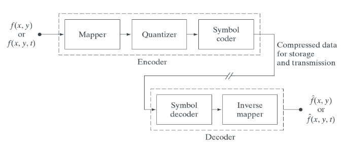

__Mapper__: transforms $f(x,\dots)$ into a usually nonvisual format designed to reduce spatial and temporal redundancy. In video applications, the mapper uses previous (and in some cases future) video frames to facilitate the removal of temporal redundancy.

__Quantizer__: reduces the accuracy of the mapper's output in accordance with a pre-established fidelity criterion. [Quantization in Image Processing](https://en.wikipedia.org/wiki/Quantization_(image_processing))

__Symbol coder__: generates a fixed or variable-length code to represent the quantizer output and maps the output in accordance with the code.

__Symbol decoder__ and __inverse mapper__ are the inverse processes.

#### Image Formats, Containers and Compression Standards

_image file format_: a standard way to organize and store image data, which defines how the data is arranged and the type of decompression.

_Image container_: similar to a file format but handles multiple types of image data.

_Image compression standards_: define procedures for compressing and decompressing images.

## 8.2 Some Basic Compression Methods

#### Huffman Coding

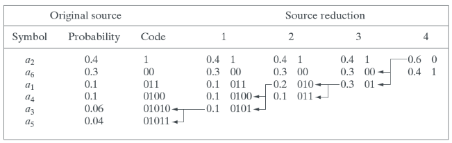

Huffman's procedure creates the optimal code for a set of symbols and probabilities subject to the constraint that the symbols be coded one at a time. The code is an _instantaneous_ (each code word in a string of code symbols can be decoded without referencing succeeding symbols) _uniquely decodable_ (any string of code symbols can be decoded in only one way)  _block code_ (each source symbol is mapped into a fixed sequence of code symbols) . When a large number of symbols is to be coded, the construction of an optimal Huffman is a nontrivial task.

#### Golomb Coding

The coding of nonnegative integer inputs with exponentially decaying probability distributions can be optimally encdoed using a family of codes that are computationally simpler than Huffman codes.

1. Form the _unary code_ (for an integer $q$, $q$ 1s followed by a 0) of $\lfloor n/m\rfloor$

2. $r=n \text{ mod } m$   
   $$
   r'=\begin{cases}r\ \ \text{truncated to $k-1$ bits} & 0\leq r<2^k-m, k=\lceil\log_2m\rceil\\
   r+c \ \text{truncated to $k$ bits} & \text{otherwise}\end{cases}
   $$

3. Concatenate the results of steps 1 and 2

A key step in their effective application is the selection of divisor $m$. Golomb codes are seldom used for the coding of intensities. 

To handle negative differences in Golomb coding, which can only represent nonnegative integers, a mapping like 
$$
M(n)=\begin{cases}2n & n\geq 0 \\
2\lvert n \rvert -1 & n < 0 \end{cases}
$$
Golomb and Huffman's codes can produce _data expansion_  when used to encode symbols whose probabilities are different from those for which the code was computed.

The _exponential-Golomb code_

#### Arithmetic Coding

A one-to-one correspondence between source symbols  and code words does not exist. Instead, an entire sequence of source symbols is assigned a single arithmetic code word.

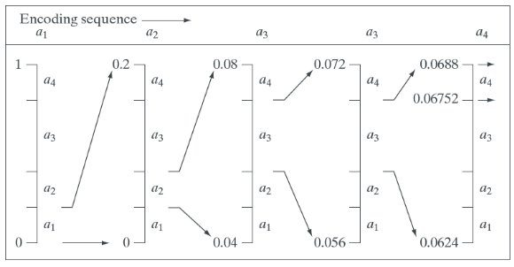

#### Adaptive context dependent probability estimates

_Adaptive_ probability models update symbol probabilities as symbols are coded or become known. _Context dependent_ models provide probabilities that are based on a predefined neighborhood of pixels (context) - around the symbols being coded. 

#### Lempel-Ziv-Welch (LZW) coding

_LZW coding_ is an error-free compression approach that also addresses spatial redundancies in an image. It assigns fixed-length code words to variable length sequences of source symbols. A key feature of LZW coding is that it requires no a priori knowledge of the probability of occurrence of the symbols to be encoded.

At the onset of the coding process, a codebook/dictionary containing the source symbols to be coded is constructed. As the encoder sequentially examines image pixels, intensity sequences that are not in the dictionary are place in algorithmically determined locations. The size of the dictionary is an important system parameter.

The image is encoded by processing its pixels in a left-to-right, top-to-bottom manner. Each successive intenisty value is concatenated with a variable called the "currently recognized sequence", intially null. If the concatenated sequence is not found, the address of the currently recognized sequnece is output as the next encoded value, the concatenated but unrecognized sequence is added to the dictionary. An LZW decoder builds an identical decompression dictionary as it decodes simultaneously the encoded data stream.

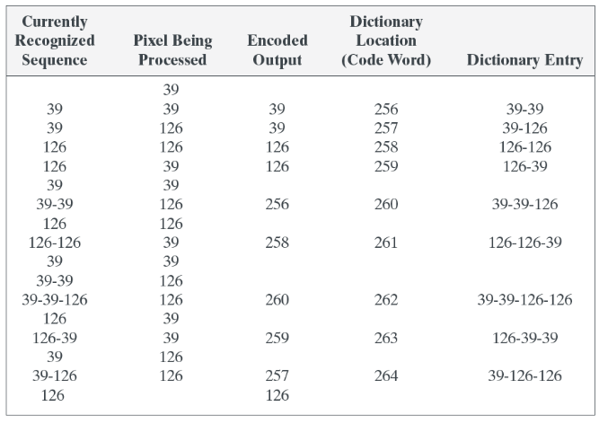

#### Run-Length Coding

When there are few or no runs of identical pixels, run-length encoding results in data expansion. Each run-length pair specifies the start of a new intensity and the number of consecutive pixels that have that intensity.

Run-length encoding is particularly effective when compressing binary images. Each image row can be represented by a sequence of lengths only. Additional compression can be achieved by variable-length coding the run lengths themselves. Two of the oldest and most widely used image compression standards are the CCITT Group 3 and 4 standards for binary image compression.

#### Symbol-Based Coding

In _symbol-_ or _token-based_ coding, an image is represented as a collection of frequently occurring sub-images called _symbols_. Each symbol is stored in a _symbol dictionary_ and the image is coded as a set of triplets ${(x_i,y_i,t_i)}$ where each $(x_i,y_i)$ pair specifies the location of a symbol in the image and token $t_i$ is the address of the symbol or sub-image in the dictionary.

#### Bit-Plane Coding

_Bit-plane coding_ is based on the concept of decomposing a multilevel image into a series of binary image via one of serveral well-known binary compression methods. The run-length and symbol-based techniques can be applied to images with more than two intensities by processing their bit planes individually.

The intensities of an image can be represented using binary code or gray code. Extract corresponding digits of every pixel and compress them using some method.

#### Block Transform Coding

An image is divided into small non-overlapping blocks of equal size and processes the blocks independently using a 2-D transform. Linear transform such as the Fourier transform is used to map each _block_ or _subimage_ into a set of transform coefficients, which are then quantized and coded.

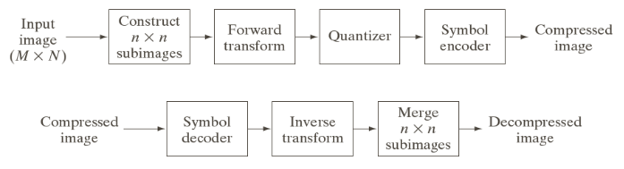

Any or all of the transform encoding steps can be adapted to local image content called _adaptive transform coding_, or fixed for all subimages called _nonadaptive transform coding_.

__Transform selection__

Consider a subimage $g(x,y)$ of size $n\times n$ whose forward discrete transform $T(u,v)$ can be expressed as
$$
T\left(u,v\right)=\sum_{x=0}^{n-1}\sum_{y=0}^{n-1}g\left(x,y\right)r\left(x,y,u,v\right)
$$
and its inverse discrete transform
$$
g\left(u,v\right)=\sum_{u=0}^{n-1}\sum_{v=0}^{n-1}T\left(u,v\right)s\left(x,y,u,v\right)
$$
A kernel is _separable_ if 
$$
r(x,y,u,v)=r_1(x,u)r_2(y,v)
$$
_symmetric_ if 
$$
r_1=r_2
$$
Best known kernel is 
$$
r\left(x,y,u,v\right)=e^{-j2\pi\left(ux+vy\right)/n}
$$
_Walsh-Hadamard transform_

_Discrete cosine transform_ (*DCT*)

The coefficient of the series can be truncated using _mean-square error_ methods

The inverse transformation can be rewritten as 
$$
\text{G}=\sum_{u=0}^{n-1}\sum_{v=0}^{n-1}T\left(u,v\right)\text{S}_{uv}
$$
Define a _masking function_ 
$$
\chi\left(u,v\right)	=\begin{cases}
0 & \text{if $T\left(u,v\right)$ satisfies a specified truncation criterion}\\
1 & \text{otherwise}
\end{cases}
$$
Then an approximation of $\text{G}$
$$
\hat{\text{G}}=\sum_{u=0}^{n-1}\sum_{v=0}^{n-1}\chi (u,v)T\left(u,v\right)\text{S}_{uv}
$$
The basis images are orthonormal and the pixels of $G$ are assumed to be generated by a random process with zero mean and known covariance, yielding the mean-square error
$$
\begin{aligned}
e_{\mathrm{ms}} &	=E\left\{ \left\Vert \mathrm{G}-\hat{\mathrm{G}}\right\Vert ^{2}\right\} 
	\\&=\sum_{u=0}^{n-1}\sum_{v=0}^{n-1}\sigma_{T\left(u,v\right)}^{2}\left[1-\chi\left(u,v\right)\right]
	\end{aligned}
$$
The information ability of the DCT is superior to that of the DFT and WHT, although the Karhunen-Loeve transform is the optimal transform, which, however, is data dependent. Hence, most transform coding systems are based on the DCT which provides a good compromise between information packing ability and computational complexity.

__Subimage size selection__

In general, both the level of compression and computational complexity increase as the subimage size increases. The most popular subimage sizes are $8\times 8$ and $16\times 16$.

In most transform coding systems, the retained coefficients are selected on the basis of maximum variance called _zonal coding_ or on the basis of maximum magnitude called _threshold coding_.The overall process of truncating, quantizing and coding the coefficients of a transformed subimage is commonly called _bit allocation_.

# Chap. 9 Morphological Image Processing

$\quad\quad$_Mathematical morphology_: a tool for extracting image components that are useful in the representation and description of region shape. Tools such as morphology and related concepts are a cornerstone of the mathematical foundation that is utilized for extracting meaning from an image.

## 9.1 Preliminaries

The _reflection_ of a set $B$: $\hat{B}=\{w|w=-b\ for\ b\quad\quad B\}$

The _translation_ of a set $B$ by point $z=(z_1,z_2)$, denoted by $(B)_z$: $(B)_z=\{c|c=b+z,\ \text{for}\ b$\quad\quad$ B\}$

_structuring elements (SEs)_: small sets or subimages used to probe an image under the study for properties of interest. An operation is on a set is defined using a structuring element.

## 9.2 Erosion and Dilation

###### Erosion

With $A$ and $B$ as sets in $Z^2$ , the _erosion_ of $A$ by $B$, defined as
$$
A\ominus B=\{z|(B)_z\subseteq A\}
$$
or
$$
A\ominus B=\{z|(B)_z\cap A^c=\varnothing \}
$$
Set $B$ is assumed to be a structuring element. We can view _erosion_ as a morphological filtering operation in which image details smaller than the structuring element are filtered.

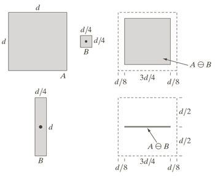

###### Dilation

With $A$ and $B$ as sets in $Z^2$ , the _dilation_ of $A$ by $B$, defined as
$$
A\oplus B=\{z|(\hat{B})_z\cap A\neq\varnothing\}
$$
or
$$
A\oplus B=\{z|(\hat{B})_z\cap A\subseteq A \}
$$
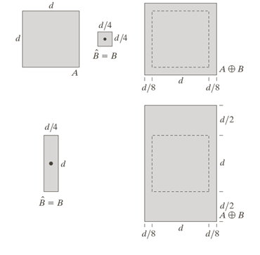

$\quad\quad$One of the simplest applications of dilation is for bridging gaps. One immediate advantage of the morphological approach over the lowpass filter method is that the morphological method resulted directly in a binary image.

###### Duality

$\quad\quad$Erosion and dilation are duals of each other w.r.t. set complementation and reflection.
$$
(A\ominus B)^c=A^c\oplus \hat{B}\\
(A\oplus B)^c=A^c\ominus \hat{B}
$$
Assume $\hat{B}=B$, we can obtain the erosion of an image by $B$ simply by dilating its background with the same structuring element and complementing the result.

## 9.3  Opening and Closing

$\quad\quad$ _Opening_ generally smoothes the contour of an object, breaks down isthmuses and eliminates thin protrusions. _Closing_ generally fuses narrow breaks and long thin gulfs, eliminates small holes and fills gaps in the contour.

$\quad\quad$The _opening_ of set $A$ by structuring element _B_, defined as
$$
A\circ B=(A\ominus B)\oplus B=\bigcup\{(B)_z|(B)_z\subseteq A\}
$$
Erosion of $A$ by $B$, followed by a dilation of the result by $B$

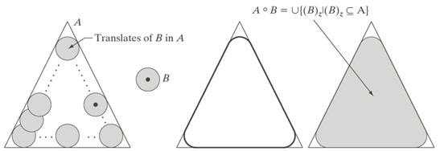

$\quad\quad$The _closing_ of set $A$ by structuring element $B$, defined as 
$$
A\ \yen\ B=(A\oplus B)\ominus B
$$
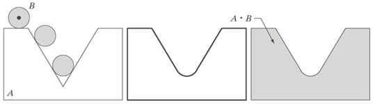

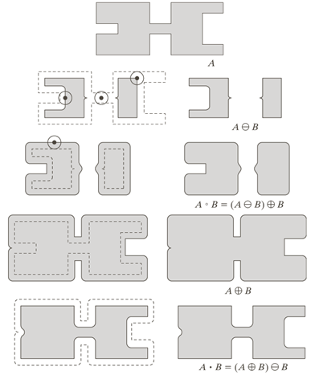

__Duality__
$$
(A\ \yen B)^c=(A^c\circ\hat{B})\\
(A\circ B)^c=(A^c\ \yen\ \hat{B})
$$
__Properties__
$$
A\circ B \text{ is a subset of }A\\
\text{If $C$ is a subset of $D$, then $C\circ B$ is a subset of $D\circ B$}\\
\text{$(A\circ B)\circ B=A\circ B$}
$$

$$
A\text{ is a subset of }A\ \yen\ B\\
\text{If $C$ is a subset of $D$, then $C\ \yen\ B$ is a subset of $D\ \yen\ B$}\\
\text{$(A\ \yen\ B)\ \yen\ B=A\ \yen\  B$}
$$

A morphological filter consisting of opening followed by closing can be used to remove noise.

## 9.4 The Hit-or-Miss Transformation

$\quad\quad$The morphological hit-or-miss is a basic tool for shape detection.

_Morphological hit-or-miss transform_: 
$$
A\circledast B=(A\ominus B_1)\cap(A^c\ominus B)=(A\ominus B_1)-(A\oplus\hat{B}_2)
$$
where $B=(B_1, B_2)$, $B_1$ is the set formed from elements of B associated with an object and $B_2$ is the set of elements of B associated with the corresponding background.

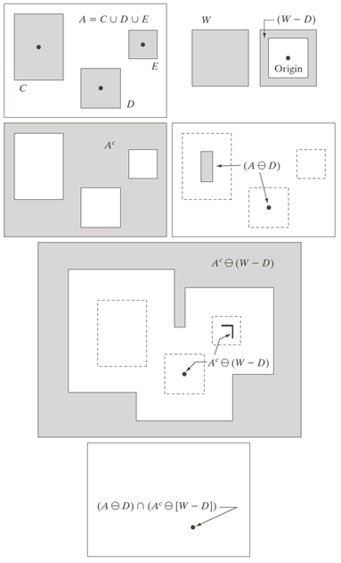

$\quad\quad$The approach here is based on an assumed definition that two or more objects are distinct only if they form disjoint sets, thus we require each object have at least one-pixel-thick background around it. If this requirement is not needed, the hit-or-miss transform reduces to simple erosion.

## 9.5 Some Basic Morphological Algorithms

$\quad\quad$One of the principal applications of morphology is in extracting image components that are useful in the representation and description of shape.

###### Boundary Extraction

$$
\beta(A)=A-(A\ominus B)
$$

where $B$ is a suitable structuring element.

###### Hole Filling

$\quad\quad$A _hole_ may be defined as a background region surrounded by a connected border of foreground pixels.

Algorithm:   

1. Initialize $X_0$ of $0s$ except at the locations where the given point corresponds to a hole.
2. _Conditionally dilate_ $X_k=(X_{k-1}\oplus B)\cap A^c \quad k=1,2,3,...$, where $B$ is a $3\times 3$ cross
3. Terminate if $X_k=X_{k-1}$ 
4. Compute $X_k\cup A$

The intersection at each step with $A^c$ limits the result to inside the region of interest.

# Chapter.10 Image Segmentation

$\quad\quad$dSegmentation subdivides an image into its constituent regions or objects. Segmentation should stop when the objects or regions of interest in an application have been detected. Most segmentation algorithms are based on one of two basic properties of intenisty values: _discontinuity_ (edge-based) and _similarity_ (region-based). the approach based on discontinuity is to partition an image based on abrupt changes in intensity, such as edges. The princial approaches based on similarity are to partitioning an image into regions that are similar according to a set of predefined criteria. _Thresholding_, _region growing_ and _region splitting_ and _merging_ are examples based on similarity.

## 10.1 Fundamentals

__Image Segmentation__: a process that partitions $R$ into $n$ subregions, $R_1, R_2, R_3,\dots,R_n$ s.t

- a. $\bigcup\limits^n_{i=1}R_i=R$, indicating that the segmentation must be complete.
- b. $R_i$ is a conneted set, $i=1,2,\dots,n.$, requring that points a region be connected in some predefined sense.
- c. $R_i\cap R_j=\varnothing$ for all $i$ and $j$, $i\neq j$ 
- d. $Q(R_i)=TRUE$ for $i=1,2,\dots,n$
- e. $Q(R_i \cup R_j)=FALSE$ for any adjacent regions $R_i$ and $R_j$.

Here $Q(\cdot)$ is a logical predicate defined over the point in set $R_k$.

Two regions $R_j$ and $R_i$ are said to be _adjacent_ if their union forms a connected set.

The fundamental problem in segemetation is to partition an image into regions that satisfy the preceding condtions.

## 10.2 Point, Line and Edge Detection

The focus here is on segmentation methods that are based on detecting sharp, _local_ changes in intensity.

*Edge pixels*: pixels at which the intensity of an image function changes abruptly  
_Edge (segments)_: sets of connected edge pixels  
_Edge detectors_: local image processing methods designed to detect edge pixels.  
_Line_: an edge segment in which the intensity of the background on either side of the line is either much higher or much lower than the intensity of the line pixels.

#### Background

There are various ways to approximate differences (e.g. first derivative or second derivative).

Consider a Taylor series and set $\Delta x=1$ , keep only the linear terms we can have a set of approximation for first- and second-derivatives.

Transitions in intensity betwwen the solid objects and the background along the scanline show two types of edges: _ramp edges_ and _step edges_.

The approach of choice for computing first and second derivatives at every pixel location in an image is to use spatial fitlers.

#### Detection of Isolated Points

See sec. 3.6 for Laplacian operator

Use the Laplacian operator and threshold the image after masking.

#### Line Detection

We can use the Laplacian mask for line detection. Mask the image with a Laplacian mask, use only the positive valudes of the masked image. There are non-isotropic Laplacian mask, able to detect lines in specified directions. Masking an image with Laplacian masks in different directions, if the value of one of them at a point is larger than the others, this one is more likely associated with a line corresponding to that direction.

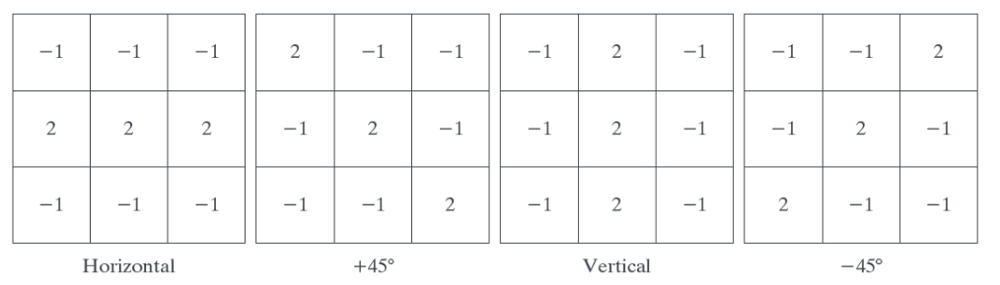

#### Edge Models

A _step edge_ involves a transition between two intensity levels occurring ideally over the distance of 1 pixel. Digital step edges are used frequently as edge models in algorithm development.

In the case of blurred and noisy image, a _ramp edge_ is likely to be used in modelling. 

_Roof edges_ arise in range imaging and in the digitization of line drawing and also in satellite images.

The magnitude of the first derivative can be used to detect the presence of an edge at a point in an image. The sign of the second derivative can be used to determine whether an edge pixel lies on the dark or light side of an edge. The second derivative around an edge proces two values for every edge in an image and its zero crossings can be used for locating the centers of thick edges. The first- and second derivative are sensitive to noise, making it difficult to detect edges. Image smoothing should be a serious consideration prior to the use of derivatives in applications.

There are three fundamental steps performed in edge detection  

1. __Image smoothing for noise reduction__
2. __Detection of edge points__: extracts from an image all points that are potential candidates to become edge points.
3. __Edge localization__: selects from the candidate edge points only the points that are true members of the set of points comprising an edge.

#### Basic Edge Detection

The tool of choice for finding edge strength and direction at location $(x,y)$  of an image is the gradient. The gradient vector is sometimes called _edge normal_. When the vector is normalized to unit length, it is commonly referred to as the _edge unit normal_.

The _Roberts cross-gradient operators_ are one of the earliest attempts to use 2-D masks with a diagonal preference, implemenrting the diagonal differences
$$
g_x=\frac{\partial f}{\partial x}=(z_9 -z_5)\\
g_y=\frac{\partial f}{\partial y}=(z_8 -z_6)
$$
$3\times 3$ masks take into account the nature of the data on opposite sides of the center point and thus carry more information regarding the direction of an edge.

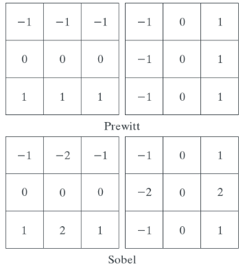

The Prewitt masks are simpler to implement than the Sobel masks. The fact that the Sobel masks have better noise-suppression (smoothing) characteristics makes them preferable because noise  suppression is an important issue whne dealing with derivatives.

$\quad\quad$dAn approach used frequently to reduce the computational burden is to approximate the magnitude of the gradient by absolute values:
$$
M(x,y)\approx \vert g_x\vert+\vert g_y \vert
$$
The price paid is that the resulting filters will not be isotropic in general. However this is not an issue whne casks such as the Prewitt and Sobel masks are used because these masks give isotropic results only for vertical and horizontal edges.

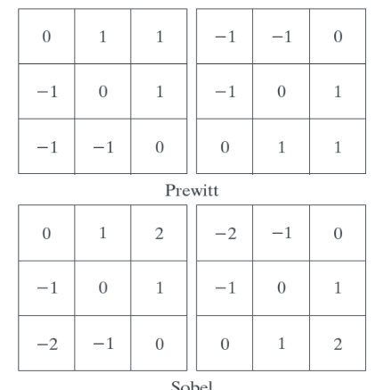

It is common terminology to use the term _edge map_ when referring to an image whose principal features are edges, such as gradient magnitude images.

In general, angle images are not as useful as gradient magnitude images for edge detection, but they do coplement the information extracted from an image using the magnitude of the gradient, such as the constant values along an edge line.

Fine details often is undesirable in edge detection because it tends to act as noise. One way to reduce fine detail is to smooth the image. Another appoach aimed at achieving the same basic objective is to threshold the gradient image. When interest lies both in highlighting the principal edges and on maintaining as much connectivity as possible, it is common practice to use both smoothing and thresholding.